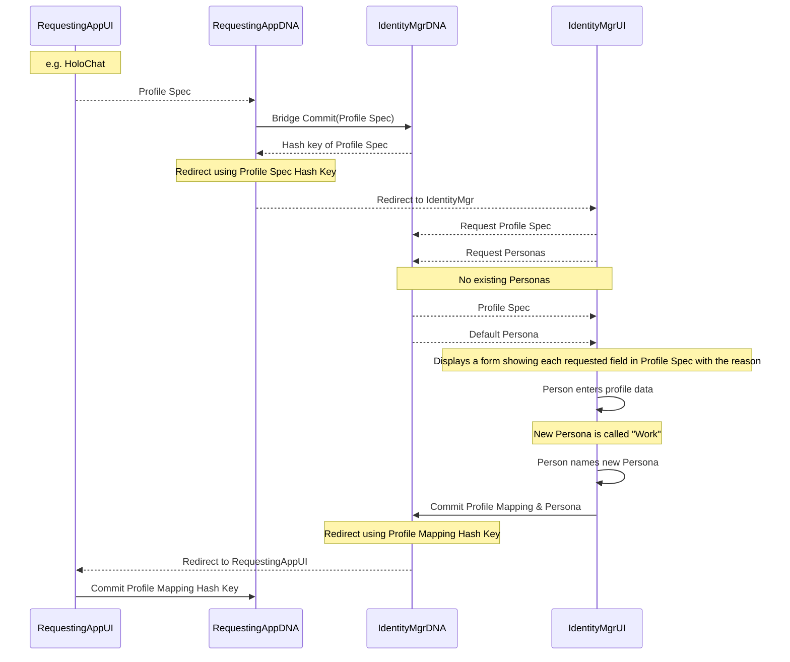
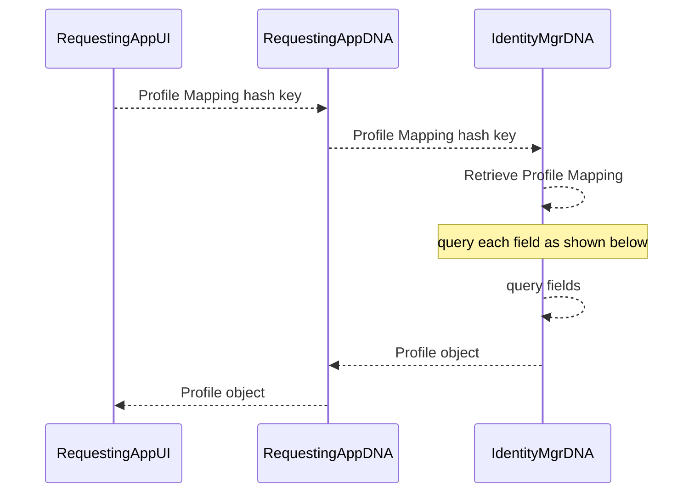
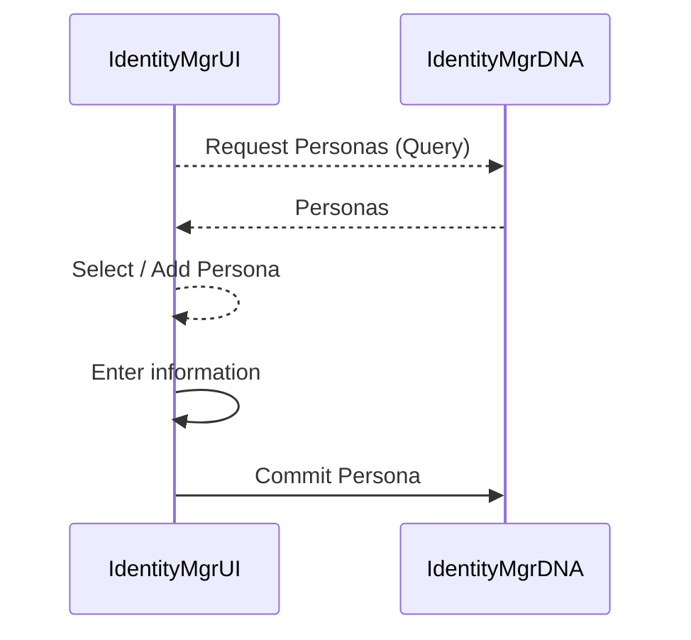

# HoloVault
European [GDPR](!https://en.wikipedia.org/wiki/General_Data_Protection_Regulation) "The GDPR aims primarily to give control back to citizens and residents over their personal data and to simplify the regulatory environment for [international business](https://en.wikipedia.org/wiki/International_business "International business") by unifying the regulation within the EU"

## Personas
You may have many personas across your digital life.  For example you may make one for your Personal details, one for your work details and one for your Friends.

## Persona Entries
```jsx=
[
    {
        "name": "Personal",
        "persona": [
            {"firstName": "Phil"},
            {"lastName": "Beadle"},
            {"address": "123 Holochain Road"},
            {"suburb": "Burwood"},
            {"city": "Melbourne"}
        ]
    },
    {
        "name": "Work",
        "persona": [
            {"firstName": "Philip"},
            {"lastName": "Beadle"},
            {"role": "Chief Engineer"},
             {"location": "Melbourne"}
        ]
    },
    {
        "name": "Friends",
        "persona": [
            "nickName": "@philt3r",
            "hobby": "DJ"
        ]
    }
]
```

## This is a Core App
All apps that need a person's Profile in their app will redirect to the "HoloVault" app. The requesting app - such as HoloChat - sends a request for a Profile by sending the Identity Manager (via the Bridge) a 'Profile Spec' that lists the fields the app would like to use. The person then uses Identity Manager to manage the profile and personas.

The "HoloVault" app will have the following features:

- Add a new Profile Mapping
- Edit a Profile Mapping
- Delete a Profile Mapping
- Add a Persona
- Edit a Persona
- Delete a Persona
- CRUD any peer content created for Apps

### Profile Spec
Send a Profile Spec to "HoloVault" to enable the person using your app to manage their profile for your app.
```jsx=

[
  {
    "appLabel": "firstname",
    "display": "First Name",
    "required": true,
    "type": "string",
    "usage": [
      {
        "type": "display",
        "reason": "So we can show your name when people click your handle"
      }
    ]
  },
  {
    "appLabel": "address",
    "display": "Address",
    "required": true,
    "type": "string",
    "usage": [
      {
        "type": "store",
        "reason": "So we can keep records of where we sent your order"
      }
    ]
  },
  {
    "appLabel": "suburb",
    "display": "Suburb",
    "required": true,
    "type": "string",
    "usage": [
      {
        "type": "store",
        "reason": "So we can keep records of where we sent your order"
      }
    ]
  },
  {
    "appLabel": "city",
    "display": "City",
    "required": true,
    "type": "string",
    "usage": [
      {
        "type": "store",
        "reason": "So we can keep records of where we sent your order"
      }
    ]
  }
]
```

### Creating a new Persona and Profile Mapping

The following message sequence diagram shows how a person would create a new Profile.  The app requesting the profile must display a reason it needs each of the fields it has requested. People can then confirm that their profile information has been used as requested by checking the contents of the requesting apps DHT and Chain. A warrant for the app my be issued by Identity Manager if found to be misusing people's profile information.


The Profile Mapping looks like this:

```jsx=
[
    {
      "appLabel": "firstname",
      "idLabel": "Work.firstname"
    },
    {
      "appLabel": "address",
      "idLabel": "Work.address"
    },
    {
      "appLabel": "suburb",
      "idLabel": "Work.suburb"
    },
    {
      "appLabel": "city",
      "idLabel": "Work.city"
    }
  ]
```

In this example the following object is returned to the RequestingAppUI when it sends the Hash Key of the above Profile Mapping

#### Profile Object
```jsx=
    {
        "firstname": "Phil",
        "address": "123 Holochain Road",
        "suburb": "Burwood",
        "city": "Melbourne"
    }
```

The following sequence shows how the RequestingApp would show an existing profile for a person by querying the field names in the request mapping.
Iterate through each field and query for the Persona using the Prefix of the field.  ie Work.firstname, query for


```jsx=

   #Update each field by iterating the array and parsing the
   personaLabel into the Identity name & field name.

[
    {
      "appLabel": "firstname",
      "personaRef": "Work.firstname"
    },
    {
      "appLabel": "address",
      "personaRef": "Personal.address"
    },
    {
      "appLabel": "suburb",
      "personaRef": "Personal.suburb"
    },
    {
      "appLabel": "city",
      "personaRef": "Personal.city"
    }
  ]
var firstname = query({Return:{Entries:true},
{Constrain:{EntryTypes:["Persona"],
Equals:{"name":"Personal"}})[0]['firstname']

```

## Managing your personas

You can add edit and delete personas in the "My Personal Data" app.



# Peer Created Content
Every piece of data you create is kept by you and shared by you at your discretion.  This includes a HOLO rate to use the piece of data.  Apps then use "request spec files" to request to read your data.  You map any fields that don't auto map and grant premission for a period of time.
Apps that ask for peer content such as HoloChat and Clutter will store the data you create in your "HoloVault"

# Permalinks App
Permanent public storage of a piece of peer created content data.
